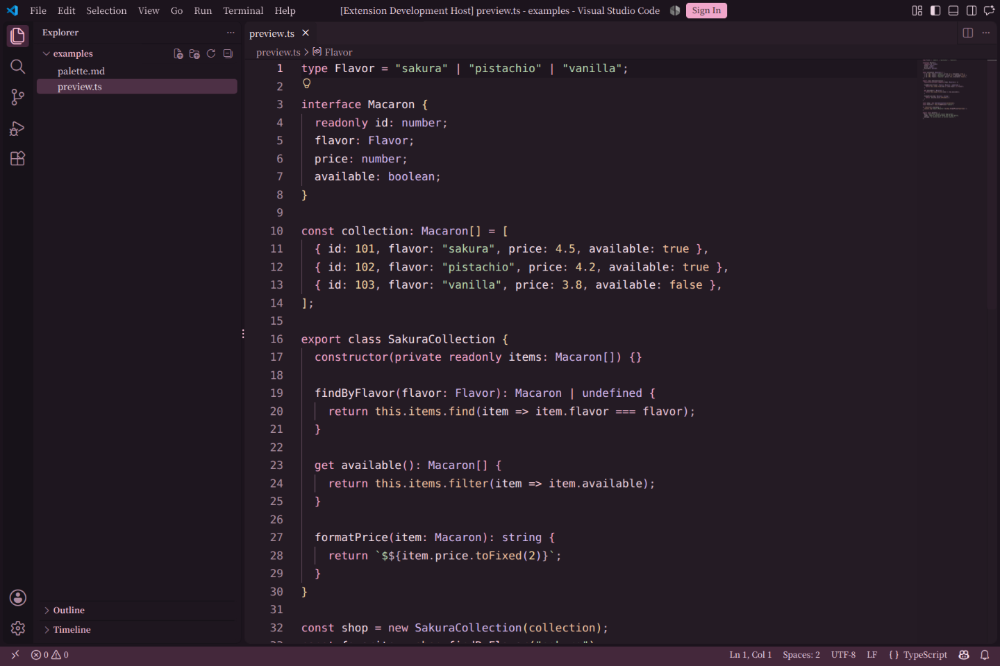
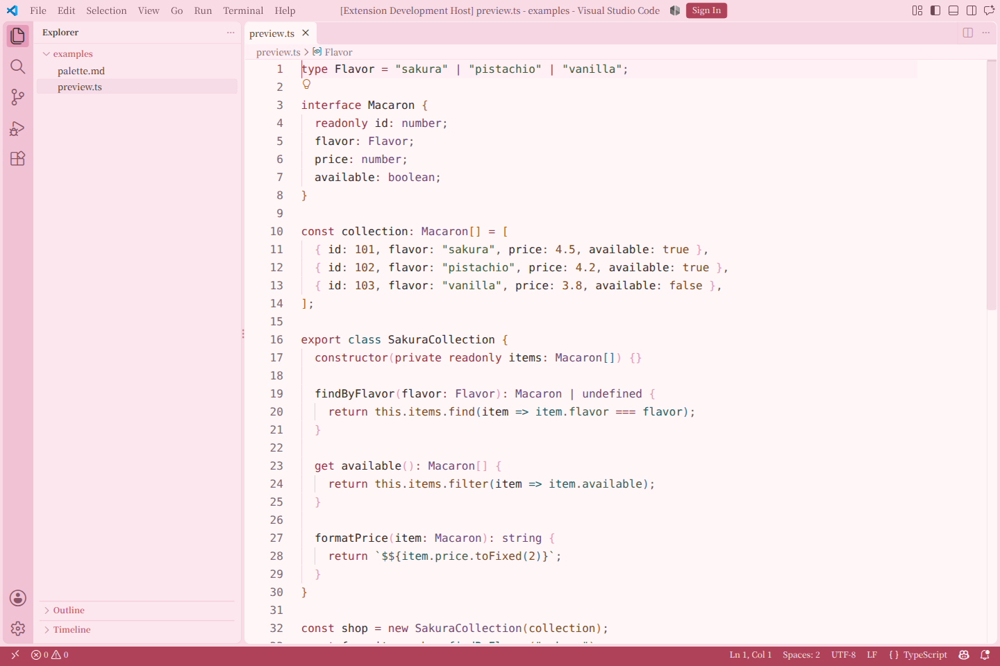

# Sakura Macaron

樱花马卡龙配色主题：Dark 夜樱、Light 樱粉，两套独立的 VS Code 主题，不依赖其他主题或运行时代码。

## 截图

### Sakura Macaron Dark

**夜樱**：樱紫黑的编辑器、深梅色侧栏与玫瑰色状态栏，搭配暖粉白正文和樱粉强调色。关键字用樱粉、函数用浅花瓣粉、类型用藤紫、字符串用鼠尾草绿、数字用奶油金；不是把所有语义角色都染成粉色。



### Sakura Macaron Light



截图来自 VS Code 1.140.0 的独立扩展开发窗口，使用仓库内 `examples/preview.ts`，不是概念渲染图。

## 特性与覆盖

- 两套主题各包含 **992 个工作台颜色键**，键集一致，覆盖编辑器、终端、Git/Diff、调试、测试、Notebook、Chat 等界面。
- **80 条 TextMate 规则、232 个 scope 条目、94 项语义高亮规则**，包含关键字、函数、类型、Markdown、正则、转义与 Diff 等分类。
- 新增、修改、删除采用不同角色色；浅色删除色为莓红，与修改色的橙棕区分。
- 自带固定快照、生成器、结构校验、静态对比度审计及回归测试，生成主题无需安装 VS Code。

**覆盖边界：** 992 项是 VS Code **1.140.0 固定样本**的候选颜色基准：966 项来自 bundle 中识别出的注册调用，26 项来自过滤后的 CSS 引用。快照逐项记录来源；CSS 引用不等同于已证明的正式注册。这里不承诺覆盖未来版本或所有第三方扩展。

## 安装与使用

在 VS Code 扩展市场搜索 **Sakura Macaron**，或通过“Extensions: Install from VSIX...”安装本地包。

1. 在命令面板运行 **Preferences: Color Theme**；Windows/Linux 也可依次按 `Ctrl+K`、`Ctrl+T`。
2. 选择 **Sakura Macaron Dark** 或 **Sakura Macaron Light**。
3. 如需跟随系统切换，添加设置：

```json
{
  "window.autoDetectColorScheme": true,
  "workbench.preferredDarkColorTheme": "Sakura Macaron Dark",
  "workbench.preferredLightColorTheme": "Sakura Macaron Light"
}
```

主题不包含文件图标主题。

## 配色一览

### 界面

| 角色 | Dark | Light |
|---|---|---|
| 编辑器背景 | `#241B24` | `#FFF6F8` |
| 侧边栏 | `#1E161F` | `#FDE7EE` |
| 活动栏 | `#171219` | `#F0C2D4` |
| 面板 | `#201720` | `#F9DBE5` |
| 状态栏 | `#44283B` | `#AF4258` |
| 编辑器正文 | `#F4DFE9` | `#3A3132` |
| 行号 | `#AB8D9F` | `#816B74` |

### 语法

| 角色 | Dark | Light |
|---|---|---|
| 关键字 | `#F3A6CC` | `#983947` |
| 函数 | `#FFD1DC` | `#28626A` |
| 字符串 | `#B8D5AD` | `#44603B` |
| 数字 | `#F4D4A2` | `#7F4D23` |
| 类型 / 类 | `#D4B8EC` | `#704C7C` |
| 常量 | `#EFC0A0` | `#7D4F26` |
| 注释 | `#BDA4B5` | `#495F51` |

界面色来源为 `src/*.json`，语法色来源为 `scripts/build_tokens.py` 的 `PALETTE`；语言服务可能选择不同语义规则。

## 对比度检查范围

每套主题静态检查 **74 组 UI、480 组 TextMate、564 组语义色组合**。默认文字阈值为 **4.5:1**，图标等非文字阈值为 **3:1**。语法色分别检查编辑器、新增行、新增文本、删除行、删除文本和选区六种背景；半透明 Diff 文本背景叠加于对应行背景后计算。

当前基准下两套主题均 **0 失败、0 未测项**。Dark 有 2 项、Light 有 3 项低对比度装饰豁免，仅涉及树缩进线和冲突边框，报告会显示理由；行号和幽灵文本不豁免。

**这不是完整 WCAG 认证。** 静态模型不能覆盖所有 UI 状态、语言规则优先级、用户覆盖色、第三方扩展、Markdown 网页或屏幕显示条件。真实截图仅验证样例编辑器外观，不能替代这些场景的人工检查。

## 兼容性

- manifest 声明最低 VS Code **1.80.0**，但本次仅在 **1.140.0** 实测主题渲染，尚未完成最低版本兼容性测试。
- 固定快照对应 commit `07f806f999227108933c2e30515b26eecc1fda74`，并保存 bundle/CSS 哈希；不宣称该版本为最新版本。
- 不同 VS Code 版本的界面与颜色支持可能不同；新增颜色需要显式更新基准和审查，不会随本机编辑器升级自动改变构建结果。

## 开发与验证

需要 **Node.js 22+**、**Python 3.10+**，并保证 `python` 命令指向 Python 3。Python 脚本仅用标准库；常规构建和校验不需要本机 VS Code 或网络，首次安装 npm 开发依赖需要网络。

```bash
npm ci --ignore-scripts
npm run build
npm run verify
npm run package
```

| 命令 | 用途 |
|---|---|
| `npm run build` | 从 `src/`、固定快照及语法色板生成两套完整主题 |
| `npm run check` | 固定键集、色值、主题结构、TextMate 与语义样式检查 |
| `npm run check:generated` | 检测手改产物、过期产物或缺失产物，不写文件 |
| `npm run check:contrast` | 严格对比度检查；失败或缺少必测颜色时返回非零 |
| `npm test` | Node 与 Python 回归测试 |
| `npm run verify` | 顺序执行全部检查与测试 |
| `npm run package` | 先验证，再生成不携带开发依赖的 VSIX |

修改配色时编辑 `src/dark.json`、`src/light.json` 或 `scripts/build_tokens.py`，再运行构建；不要直接修改生成的 `themes/*.json`。

升级 VS Code 快照需要本机编辑器和人工审查，使用 `npm run registry:update -- --vscode-path <resources/app>`。当前锚点解析器仅允许已验证的 commit，不支持的新版本会拒绝更新，且解析失败不改变 `data/`。详见 [维护指南](docs/maintenance.md)。

## 问题反馈

请在项目仓库提交 Issue，并附上 VS Code 版本、主题名称、语言/扩展、相关设置和截图。

## License

[MIT](LICENSE)
